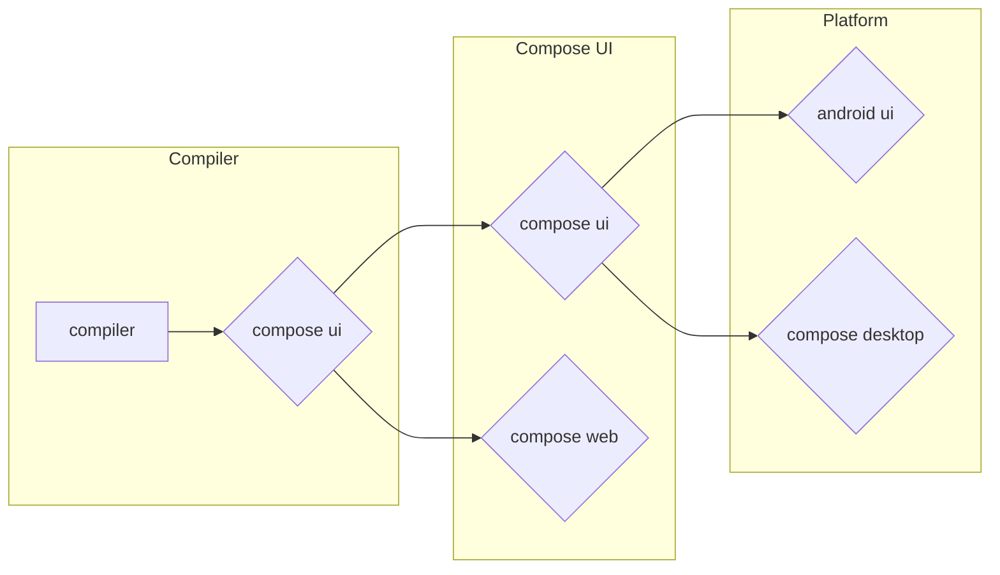

## Compose Runtime vs Compose UI

**Explanation:**

* **Graph Layout:** The graph is laid out in a left-to-right direction.
* **Subgraphs:** We use subgraphs to organize the different parts of the workflow (Compiler, Runtime, Compose UI).
* **Arrows:** Arrows indicate the flow of information or process between components. 

Let me know if you'd like to explore other graph styles!
## Re Introducing composition
- Composition은 모든 Composable 함수 컨텍스트 제공
- lotTable 기반의 “캐시“제공
- Applier를 통해 사용자 정의 트리를 생성할 수 있는 interface 제공
	- Composition에 의해 생성된 트리를 생성하고 연결하는 방법을 구현해둔 Applier
## Composition of vector graphics
- path, group 은 composition 에 있으면 ui composable 에서 사용할 수 없다.
## Building vector image tree
- VNode
- VectorApplier
	- topDown
	- bottomUp
- fun DrawScope.draw() 제공

## Integrating vector composition into Compose UI
Render Vector does not exist

## Managing DOM with Compose
- HTMLElement
- DOMApplier

## StandAlone composition in the browser

