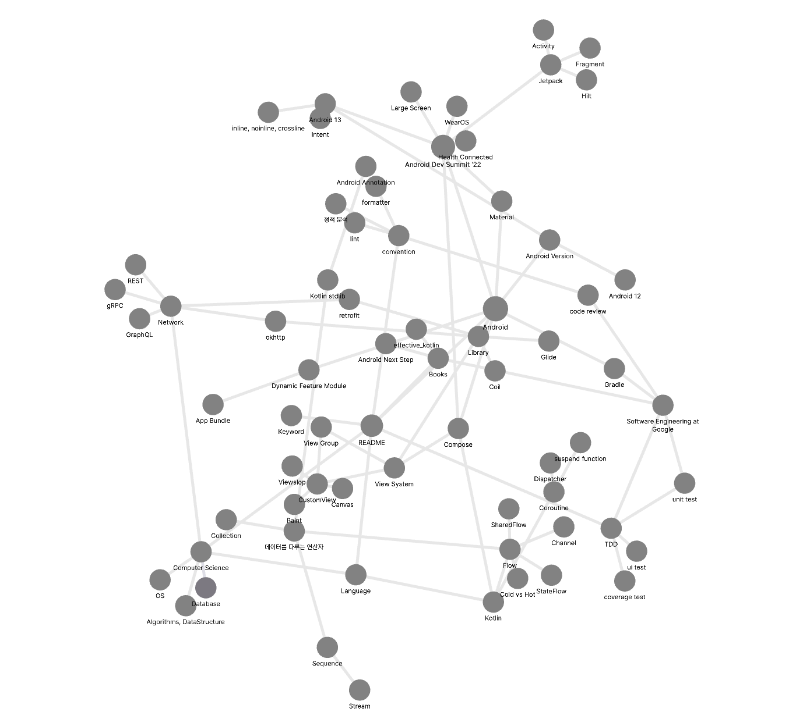

# Keelim-Knowledge-Vault

## Books
- Effective Kotlin [[effective_kotlin]]
- 안드로이드 프로그래밍 Next Step [[Android Next Step]]
- 프로페셔널 안드로이드

## Android
- Dynamic module (동적 모듈) [[Dynamic Feature Module]]
- Gradle, Kotlin DSL [[Gradle]]

### Android Version (특이사항 정리)
#### 12 (API 31-32) [[Android 12]]
#### 13 (API 33) [[Android 13]]

## Kotlin
- 코틀린 연산자 [[데이터를 다루는 연산자]]
- inline, noinline, crossinline [[inline, noinline, crossline]]
### Coroutine
- Dispatcher
- suspend function [[suspend function 중단함수]]
### Flow[[Flow]]
- StateFlow [[StateFlow]]
- SharedFlow [[SharedFlow]]
- Channel [[Channel]]
### Compose
- Glance
- 
## 좋은 개발자가 되는 법
- 소프트 스킬을 늘려보자, 다양한 생각을 들어보자
## Todo
- 저장소 구경하기
	- https://github.com/android/compose-samples